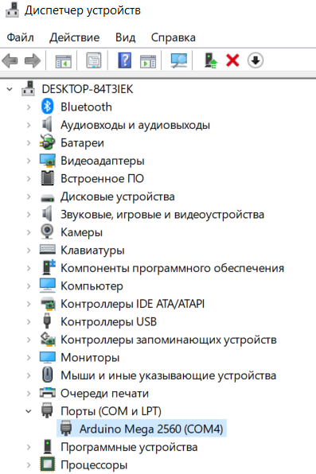
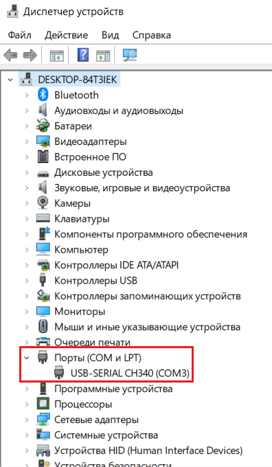
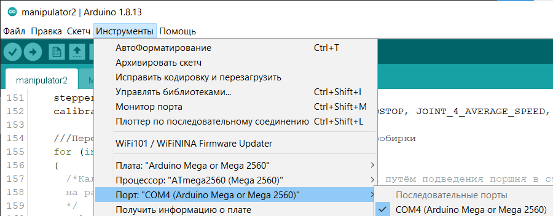
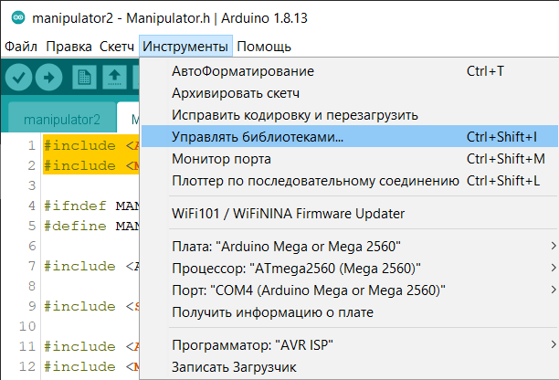
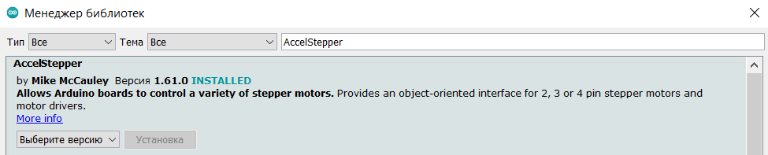
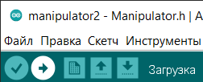

# ManipulatorBCN3D_API
Python interface for BCN3D Moveo manipulator controlling via Arduino Mega

## Arduino Firmwire 
Firstly, to controll the robot with python API, we have to upload our firmwire to Arduino Mega.

### <a name="48"></a> Работа с Arduino IDE и установка прошивки
1. [Скачайте](https://www.arduino.cc/en/software) установщик среды разработки Arduino IDE и установите.
2. Подключите контроллер Arduino Mega к компьютеру с запущенной средой Arduino IDE и включите его питание.
3. [Скачайте](https://www.arduino.cc/en/software) и установите драйвер CH340 (чтобы учесть все версии Arduino Mega).
4. Откройте диспетчер устройств на компьютере и убедитесь, что контроллер распознаётся компьтером (как показано на одном из примеров): <div align="center"></div>
5. Откройте Arduino IDE на компьютере и выберете порт устройства (как показано на примере):<div align="center"></div>
6. Установим библиотеки `AccelStepper` и `MultiStepper`: <div align="center"></div> <div align="center"></div>
7. Загрузим прошивку `manipulator2.ino` из папки `manipulator2` в контроллер: <div align="center"></div>

### <a name="49"></a> Пример реализации собственных алгоритмов

Для того, чтобы работать с манипулятором, необходимо его откалибровать, а именно задать все параметры в файле `Manipulator.h`, в соответствие с комментариями. В файла `Titrator.cpp` и `Titrator.h` находится всё, что необходимо для работы с дозатором. Их следует рассмотреть и настроить некоторые параметры в соответствие с изложенными там комментариями. Файл `manipulator2.ino` определяет общий алгоритм движения манипулятора и является примером написанного алгоритма. По комментариям, находящимся в файле, возможно настроить свой алгоритм действий манипулятора, а так же настроить конфигурацию самого манипулятора. Программа может требовать доработки в зависимости от конкретной задачи. По сути, в алгоритме используются функции, которые определены в файле `Manipulator.h`

## Downloading Python API
The next step is to download [Python](https://www.python.org/downloads/) API:
```
git clone https://github.com/AlexandrNikolaev0/ManipulatorBCN3D_API.git
```
Making a virtual enviroment:
```
cd ManipulatorBCN3D_API
python -m venv manAPI_env
cd manAPI_env/Scripts
activate.bat
cd ../..
pip install -r requirements.txt
```

## Testing the camera odometry
For that step you have to calibrate your camera, which you want to put on the instrument, making a YAML calibration file.
1) Prepare a real chessboard with ceverall cells for each side.
2) Make 15-30 photos of the chessboard in different positions on your camera and save them in ```ManipulatorBCN3D_API/myCameraChessPhotos```.
3) Open the ```cameraCalibrate.py``` file and change ```number_of_squares_X, number_of_squares_Y, square_size, images, cv_file``` according to the comments and your individuall equipment.
4) Run ```python cameraCalibrate.py```, using the manAPI_env.

The main file for testing the camera is ```odometryTest.py```.
You have to open and personalize the next parameters, according to your stuff:

1) ```aruco_marker_side_length``` - the standart marker size, that we use

2) ```aruco_dictionary_name``` - the simplest aruco dict, that we use. The full list of dictionaries you can find in the class arucoOdometry beginning (file ```arucoOdometry.py```)

3) ```camera_calibration_parameters_filename``` - here you have to put the filename, that we got as a result of the calibration (it corresponds to ```cv_file``` in ```cameraCalibrate.py``` file)

4) ```cap = cv2.VideoCapture(id)``` - you have to put the number of your camera instead of the ```id```. Usually, it is 0, 1, 2... Depending on the count of connected to the PC cameras.

5) Here you have to set the camera resolution (the same as have the calibration photos):
```
cap.set(cv2.CAP_PROP_FRAME_WIDTH, 1280)
cap.set(cv2.CAP_PROP_FRAME_HEIGHT, 720)
```
6) Define the markers list. Example:
```
markers = [
{"id":0,"size":aruco_marker_side_length},
{"id":8,"size":aruco_marker_side_length},
{"id":10,"size":0.035}
]
```
7) For the function ```odom.updateCameraPoses(frame,time.time()*1000-startTime, 8)``` as the last argument, you have to put the id of marker, that you want to detect.

Run the test ```python odometryTest.py```

## Run the main algorithm
An example of algorithm is provided in ```main.py``` file. You can take the template from there to write your own algorithm, based on ```ManipulatorAPI.py```

